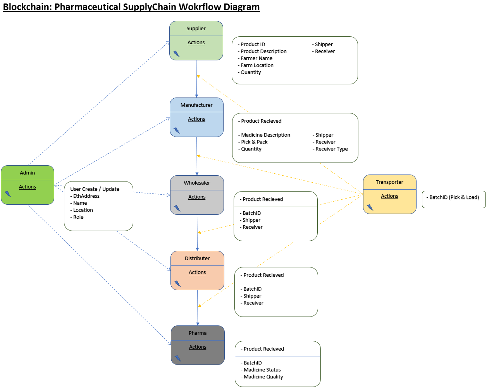

# Blockchain : Pharmaceutical SupplyChain
This project showcases the journey of Medicine on blockchain.

The Pharmaceutical supply chain is the sequence of activities and process to bring raw drugs and matrials from supplier(farms) to processed medicine in Pharm.

#### Problems in Exixting System 
---
- Shipment visibility
- Expiration
- Slow Process and Error prone paper work
- Mutable and Invalid source
- Lack of coordination

#### What we are providing
---
- Accurate information across the entire chain at any point and at any location
- Instant access to real-time updates and alerts if issues are detected
- Visibility of all handovers in the supply chain
- Traceability back to source of all materials
- Seamless collaboration between all parties
- Reduce paper work and Speedup process

#### Application Workflow Diagram
---


#### Roles
---
1. Admin
2. Supplier
3. Transfporter
4. Manufacturer
5. Wholesaler
6. Distributer
7. Pharma

**Admin :** Admin register new users and assigne roles accourding to there work.
**Supplier :** Supplier supply raw materials manufacturer by creating new batch with details of farm.
**Transporter :** Transporter are responsible for shipping packages/consignment form one stage to other.
**Manufacturer :** Manufacturer is responsible to manufacturer new medicine batches for shipping to either Wholesaler or Distribute, by updating information of raw materials details(like batchID and consumption units) that are use to manufacture new batch medicine and quantity. 
**Wholesaler :** Wholesaler is reponsible to receive medicine from Manufacturer and validate medicine quality, than transfer to Distributer.
**Distrubuter :** Distributer is reponsible to distribute medicne to pharms and do varification on medicine quality and condition.
**Pharma :** Pharma is reponsible to provide right medicine to customer as per doctor priscribed and update medicine status.

#### Tools and Technologies
---
- Solidity (Ethereum)
- Metamask (Ethereum wallet)
- Ganache test network 
- Truffle
- Web3JS 
- AngularJS

#### Prerequisites
---
- Nodejs v8.12 or above
- Truffle v5.0.0 (core: 5.0.0) (http://truffleframework.com/docs/getting_started/installation)
- Solidity v0.5.0
- Metamask (https://metamask.io)
- Ganache (https://truffleframework.com/docs/ganache/quickstart)

#### Contract Deployment Steps:
---
**Setting up Ethereum Smart Contract:**

```
git clone https://github.com/kamalkishorm/Blockchain_SupplyChain.git
cd Blockchain_SupplyChain/
```
**Update truffle.js **

```
module.exports = 
{
    networks: 
    {
	    development: 
		{
	   		host: "localhost",
	   		port: 8545,
	   		network_id: "*" // Match any network id
		} 
    }
};
```
Go to your project folder in terminal then execute :

```
rm -rf build/
npm install -g ganache-cli
ganache-cli
truffle compile 
truffle migrate
```
**Please note:**
1. After successfully deployment you will get response in bash terminal like below
```
Starting migrations...
======================
> Network name:    'development'
> Network id:      5777
> Block gas limit: 6721975


1_initial_migration.js
======================

   Deploying 'Migrations'
   ----------------------
   > transaction hash:    0x75367f6f62cf5f2c05a2c1ffa97a5da3e8ee624ef4957cc27e9611f698709deb
   > Blocks: 0            Seconds: 0
   > contract address:    0x45fbF1DAC557bbEEe1b1505546f0CD6BEe21A9c4
   > account:             0x8e2ec015314C9F9e3E7Cfb342621d6507E7C087a
   > balance:             99.99430184
   > gas used:            284908
   > gas price:           20 gwei
   > value sent:          0 ETH
   > total cost:          0.00569816 ETH


   > Saving migration to chain.
   > Saving artifacts
   -------------------------------------
   > Total cost:          0.00569816 ETH


Summary
=======
> Total deployments:   1
> Final cost:          0.00569816 ETH
```